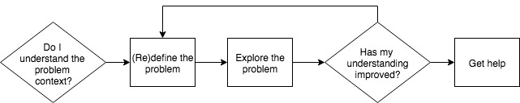
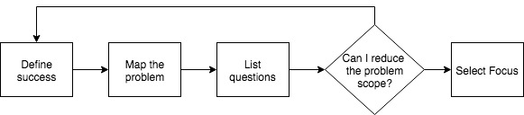
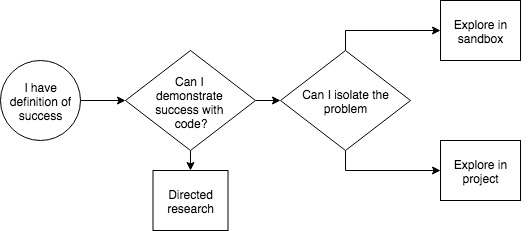
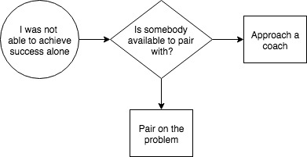

# Problem: I don't understand the problem context

A key virtue here is *patience*. Taking the time to explore the problem and read documents carefully.

## Examples
My database is not in the state I expect it to be. I want to debug but I don't understand how migrations work.
I am trying to write a component in React but it is not appearing on the page. I don't really understand how the React app works.

## Techniques
The techniques below help you to build a better mental model of the problem space, either through archaeology or visualisation. A good process to follow might be:

### Define the problem

#### Define the problem
"I don't know how React works" isn't a good problem statement - it doesn't state what you are trying to do. You should always have an end goal in mind, because if you don't you have no way of knowing when you have succeeded. "I don't know how to build a web form with React" is better, because you know that your problem is resolved either when (a) you have successfully built a web form with React of (b) demonstrated that this is not possible.

#### Map the problem
Mapping the problem means producing a representation of it. This usually involves diagramming and language. At the end of this process, you should have a model, however high level, of the problem area.

#### Identify areas of uncertainty
From your map, you should then be able to identify which bits of the model you think you understand and which bits of the model require more research. Ideally, you have a list of questions, e.g.:
- React uses JSX, but I don't know what that is
- I don't know how to set up a React project

### Reduce the scope of the problem
Trying to solve everything at once is a recipe for confusion. Pick one of your questions above and attack that, e.g. focus on "I don't know how to set up a React project".

### Explore the problem

#### Run an experiment
Applied analytical skills are always going to give you a better understanding of a specific problem area than reading about it. For example, you could read about setting up a React project or you could just go ahead and do it. Define a definition for success - in this case, it's probably "Hello world" on a page - and have a go.

At the end of the process, if you have succeeded, you should have a better understanding of this particular bit of your problem. If you don't, then ask yourself why - for example, if you just used the script "create-react-app" then it probably did all of the setup for you and you didn't really get a chance to set up the project yourself. Was your goal just to get a React project up and running, or was it to understand what the components of a React project are? If the latter, revisit your experiment constraints - set up a react app without using the create-react-app script.  

#### Research
Your friend Google.

### Has my understanding improved?

### Get Help

#### Pair with somebody
Working on something with somebody else can help you develop a shared understanding of a problem.

#### Ask for help
If you can demonstrate that you've done some or all of the above, find a coach and see if they can help unblock your understanding. If you've talked to your peers and they haven't been able to help then it's likely this is a problem that others face as well, so gather anybody else who might be interested in a whiteboard session.  
